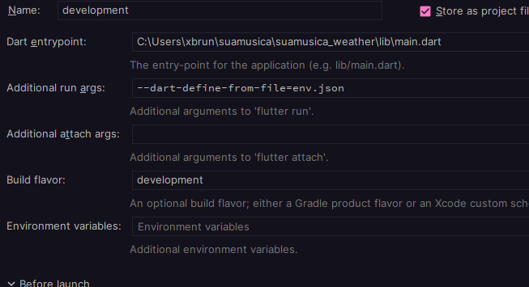
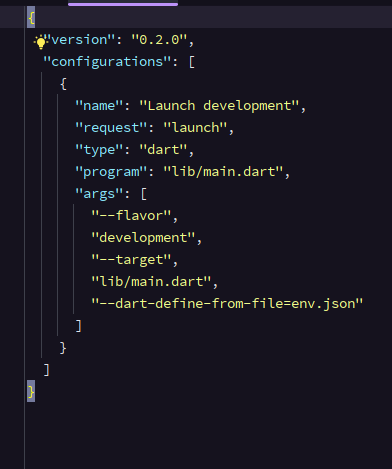
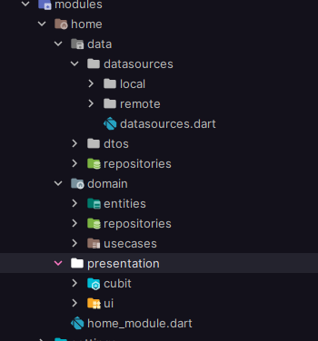
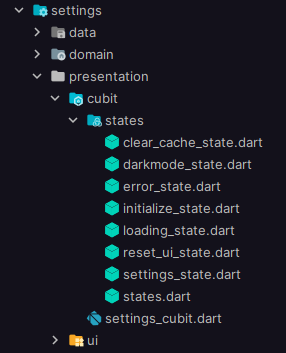
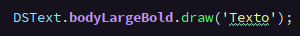
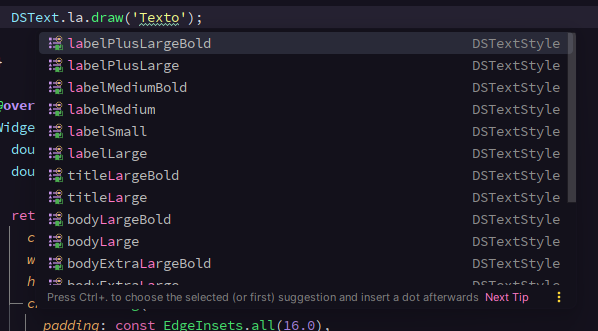
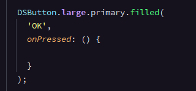
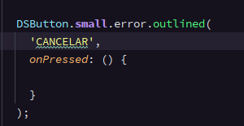

# @SuaMusica Challenge

#### A API ADOTADA PARA A SOLUÇÃO FOI A https://api.tomorrow.io EM TESTES DE INTEGRAÇÃO A API SUGERIDA SE MOSTROU MENOS EFICAS PARA O OBJETIVO DO CHALLENGE
DENTRO DAS VARIAVEIS DE AMBIENTE VOCE ENCONTRA 3 KEYS DE API, CASO UMA EXPIRE UTILIZE A OUTRA.
POR PADRÃO A KEY USADA É A **tomorrow_token**


## ATENÇÃO

### VSCode ou intellij idea

Antes de rodar o projeto adicione o argumento
```--dart-define-from-file=env.json``` em seu arquivo de execução

- Exemplo no intellij:


- Exemplo VSCode:


---------------

### Arquitetura/Padrões
Clean Architecture

Clean Code

SOLID


 
----------------

### Gerenciamento de Estado

Bloc/Cubit

#### EXISTEM 2 ABORDAGENS DE FLUXO DE ESTADOS 
- No Módulo **settings** voce encontra a mais convencional onde emitimos 1 State para cada ação.


----------------

- Já no Módulo **home** utilizei uma abordagem que tem sido discutida em alguns foruns, um unico **state** concentra varias informações e é persistido


----------------

### Roteamento

Modular

----------------

### Testes
mocktail

flutter_test

bloc_test

----------------

### Cache
Todas as chamadas de API que trazem dados historicos onde não existe finalidade aparente de visualização em tempo real segue uma logica de cache dinamico


----------------

### Tooling
.env (Variaveis de ambiente)


----------------

### UI
Design System

Dark Mode 

Design Token

Lottie


Os componentes do Design System são reativos ao DarkMode, não necessitando de alteração pontuais.

---------------

- Exemplos Design Token **Text**:





---------------

- Exemplos Design Token **Button**:




### MUITO OBRIGADO